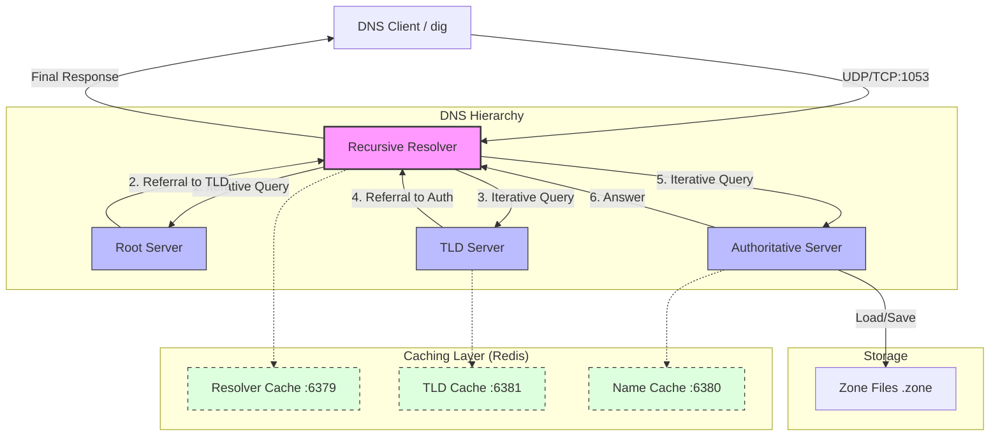

# 🌐 Distributed DNS Server Suite

A high-performance, RFC-compliant DNS implementation built in Python. This project features a full DNS hierarchy including Root, TLD, and Authoritative servers, orchestrated by a Recursive Resolver with multi-tier caching.

---

## 🏗️ Architecture Overview

The system simulates the real-world DNS resolution process. The **Recursive Resolver** acts as the primary entry point for clients, interacting with the hierarchical DNS layers to resolve queries.



---

## ✨ Key Features

-   **RFC Compliance**: Strictly follows RFC 1034, 1035, and 2181 for DNS message formatting and resolution logic.
-   **Hierarchical Resolution**: Implements Root (`.`), TLD (e.g., `.com`, `.org`), and Authoritative server layers.
-   **Dual Transport**: Supports both **UDP** and **TCP** (required for larger responses and AXFR).
-   **Multi-Tier Caching**: Dedicated Redis instances for different server types to minimize latency.
-   **Zone File Persistence**: Authoritative servers can load from and save to standard `.zone` files.
-   **Rich Record Support**: Handles `A`, `NS`, `MX`, `SOA`, `PTR`, `TXT`, `CNAME`, `HINFO`, `MINFO`, and more.

---

## 🚀 Quick Start

### Prerequisites
-   [Docker & Docker Compose](https://docs.docker.com/get-docker/)
-   [Python 3.11+](https://www.python.org/downloads/) (for local development)

### Running with Docker (Recommended)
The easiest way to get the entire suite running (including Redis) is via Docker Compose:

```bash
# Start all services (DNS Server + 3 Redis Instances)
docker-compose up --build -d
```

### Testing the Server
You can use `dig` to test the server once it's running:

```bash
# Query an A record
dig @localhost -p 1053 example.com

# Query an MX record
dig @localhost -p 1053 example.com MX

# Force TCP
dig @localhost -p 1053 example.com +tcp
```

---

## 📂 Project Structure

```text
├── app/                    # Core Application Logic
│   ├── main.py             # Entry point & Orchestration
│   ├── resolver.py         # Recursive Resolver Logic
│   ├── root.py             # Root Server Implementation
│   ├── tld.py              # TLD Server Implementation
│   ├── authoritative.py    # Authoritative Server Implementation
│   ├── Server.py           # Base Server Class
│   ├── BaseCache.py        # Abstract Caching Layer
│   ├── udp_transport.py    # UDP Listener
│   ├── tcp_transport.py    # TCP Listener
│   └── utils.py            # DNS Parsing & Byte Utilities
├── master_files/           # Authoritative Zone Data (.zone)
├── docker-compose.yml      # Multi-container Orchestration
├── dockerfile              # App Containerization
└── generate_diagram.py     # Script to regenerate architecture diagrams
```

---

## ⚙️ Configuration

The server can be configured via environment variables in `docker-compose.yml`:

| Variable | Description | Default |
|----------|-------------|---------|
| `REDIS_RESOLVER_HOST` | Hostname for Resolver Redis | `localhost` |
| `REDIS_AUTH_HOST` | Hostname for Authoritative Redis | `localhost` |
| `REDIS_TLD_HOST` | Hostname for TLD Redis | `localhost` |
| `LOG_LEVEL` | Logging intensity (DEBUG, INFO, etc.) | `INFO` |

---

## 🛠️ Advanced: Manual Refactoring Recommendations

To further improve this codebase, we suggest:
1.  **Sub-packaging**: Move server implementations into `app/servers/` and transport into `app/transport/`.
2.  **Configuration Object**: Replace `os.getenv` calls with a centralized `Pydantic` settings object.
3.  **Unified Caching**: Consolidate Redis logic into a single service using different database indexes instead of separate instances if resources are constrained.
